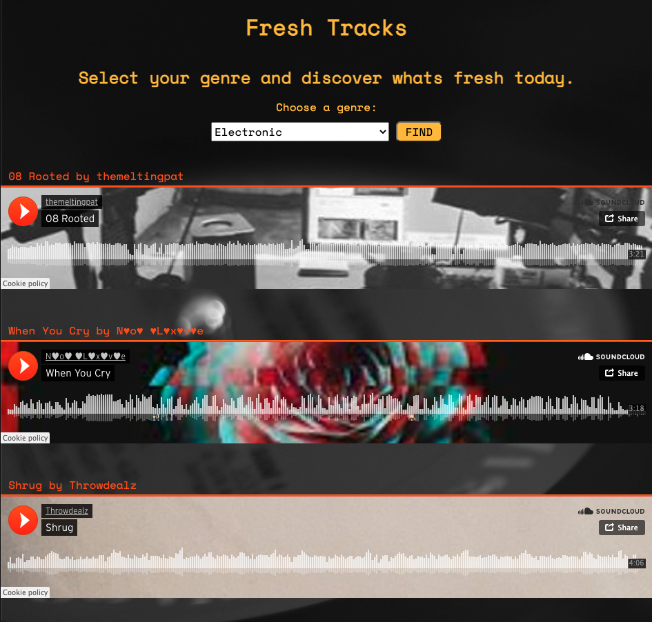

# Fresh Tracks
Using the Soundcloud API a user can select a genre of music they are interested in and be presented with a track that was uploaded today!

### Live App:
https://jluse.github.io/fresh-tracks/

### Summary:
Fresh Tracks allows user to select Soundcloud support genres from a dropwdown to then click a button that generates various tracks within that genre that have been uploaded on todays current date. This simplicity of finding tracks that were uploaded today based on a certain genre is something currently not offered in Soundcloud app. This functionality is focused towards DJs or users who want the latest tracks.

### Technologies
HTML / CSS / JavaScript / jQuery
